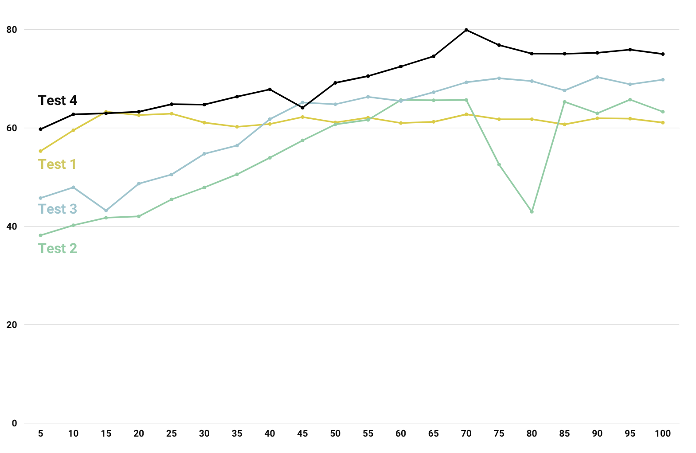

By JIANG Zeyu and HUANG Yining of group Stonks

# Introduction

There are a lot of parameters that involved in the training process of a CNN model, and they may deeply influence the accuracy of the model. When we are training our model, we mainly encountered with the following parameters.

1. **Learning rate**

   Learning rate serves as a weight for each learning process. It could decide how much could the algorithm update the network. Simply speaking, it could limit the info your algorithm pass to the final model.

2. **Epochs**

   This might be the parameter you'll encounter the most. It decides how many times your data is passed to the network.

3. **Batch Size**

   Though you may think it would play a little part in the result, since it only decides the number of sample passed to the network at once and a small batch size would only results in more times of training in one epoch. However, it turns out CNN is highly sensitive to batch size.

4. **Dropout Method**

   It's actually a layer help to reduce overfitting. It decides the probabilty we won't activate the neural.

5. **Static**

   Whether to let embedding layer to train with the whole network.

# Let's Start

Here, we use half of our news data associated with stock price data to do the training, basing on the model in the paper ***"Convolutional Neural Networks for Sentence Classification"*** by Yoon Kim. It's a simple CNN model with a convolutional layer on word vectors followed by over-pooling and softmax layer. Initially, we've set the following parameters. (**#1 Attempt. Initial**)

```
Learning Rate: 0.1
Epochs: 100
Batch Size: 128
Dropout: None
Static: None
```


We get the training outcome as follows. You could see the training accuracy only increase from the start to epoch 15. Then, we also observe the test accuracy is around 60%, while on the validation set, the accuracy is around 65% till the end. So we try to add a dropout of 0.5 first. It did solve the problem of overfitting. (**#1.5 Attempt. Add dropout layer**)

Afterwards, we observe the accuracy only increase in the first few epochs, that is converging so fast. So we try to make the learning rate lower, leaving other parameters the same. (**#2 Attempt. Lower the learning rate**)

```
Learning Rate: 0.01
Epochs: 100
Batch Size: 128
Dropout: 0.5
Static: None
```


We could see the accuracy indeed matches more with the epochs of training, proving our guess of learning rate is true. However, we still cannot have a satisfied accuracy. After checking a lot of papers, we have the information that convolutional neural network is highly sensitive with batch size, and prefer a lower batch size. Therefore, we make our batch size a little bit lower. We also add static here to make our embedding layer do not train with our whole network. (**#3 Attempt. Lower the batch size**)

```
Learning Rate: 0.01
Epochs: 100
Batch Size: 32
Dropout: 0.5
Static: True
```


After these tweaks, we get the accuracy on test set from 60% to around 70%, which is quite a huge leap for us, but we are still not satisfied with the result. Then, we decide to adjust the model. We take a mutiple layer CNN model for image processing for sample, and try to tweak the model by adding more layers. This is not a complicated work, considering there's only one pair of sampling and convolution layers, we directly add another pair of sub-sampling and convolution layers behind them before the data been passed to the full-connected softmax layer. The result is astonishing. (**#4 Attempt. Add another pair of sampling and convolution layers**)



Finally, we arrived an accuracy of around 75% on test set.

# Conclusion

We actually reached an accuracy of 80% by adding another pair of sub-sampling and convoluion layer, and the accuracy won't increase much when we try to add another pair. Also, our hardware cannot afford that much of computation when we lower the learning rate and increase epochs as well.

From all the tuning we did, we figure out how the parameters of training would affect the training result and how important the model is. No matter how you could perfect your parameters, the focus should always be the improvement of the model.