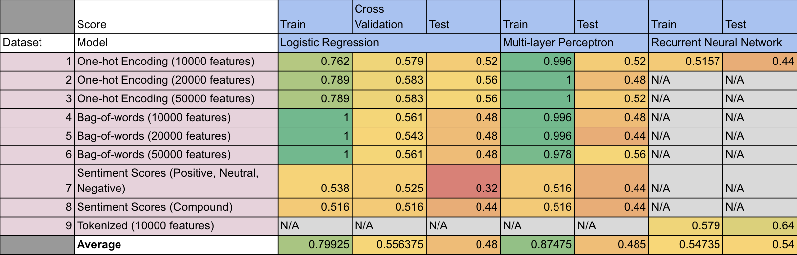

By Group "Nebula"

## Blog 4: Machine Learning Model Training

### Introduction
The datasets that we prepared in the previous steps are used to train different machine leaning model. We then evaluate the model base on the experiment results, suggest some issues identified and potential ways to solve them.

### Machine Learning Model
The following machine learning models are used in model training:
- Logistic Regression (LR)
- Multi-layer Perceptron (MLP)
- Recurrent Neural Network (RNN)

#### Confusion Matrix
A confusion matrix with test accuracy is plotted to visualize the results.

```python
from sklearn.metrics import ConfusionMatrixDisplay

def display_confusion_matrices(model, X, y):
    disp = ConfusionMatrixDisplay.from_estimator(
        model,
        X,
        y,
        display_labels=sorted(np.unique(y)),
        cmap=plt.cm.Blues,
        normalize="true",
    )
    disp.ax_.set_title("Normalized")

    disp = ConfusionMatrixDisplay.from_estimator(
        model,
        X,
        y,
        display_labels=sorted(np.unique(y)),
        cmap=plt.cm.Blues,
        normalize=None,
    )
    disp.ax_.set_title("Unnormalized")

    plt.show()
```

#### Logistic Regression (LR)

```python
from sklearn.linear_model import LogisticRegression
from sklearn.model_selection import GridSearchCV

lr1 = LogisticRegression(C=100.0, solver='liblinear', multi_class='ovr', random_state=4350)

param_grid = {'C': [0.001, 0.01, 0.1, 1.0, 10.0, 100.0, 1000.0],
              'penalty': ['l1', 'l2']}

gs1 = GridSearchCV(estimator=lr1, param_grid=param_grid, scoring='accuracy', cv=10, n_jobs=-1)
gs1.fit(X1_train_oh, y1_train)

best_lr1 = gs1.best_estimator_
best_lr1.fit(X1_train_oh, y1_train)

y_pred = best_lr1.predict(X1_test_oh)
print("Test Accuracy: %.3f" % best_lr1.score(X1_test_oh, y1_test))

display_confusion_matrices(best_lr1, X1_test_oh, y1_test)
```

#### Multi-layer Perceptron (MLP)

```python
from sklearn.neural_network import MLPClassifier

mlp1 = MLPClassifier(solver='adam', alpha=1e-5, learning_rate='adaptive', max_iter=1000, activation = 'relu', hidden_layer_sizes=(256,), random_state=3362)
mlp1.fit(X1_train_oh, y1_train)

print("Test Accuracy on train dist: %.3f" % mlp1.score(X1_test_oh, y1_test))

display_confusion_matrices(mlp1, X1_test_oh, y1_test)
```
#### Recurrent Neural Network (RNN)

```python
from keras import models
from keras import layers
from keras import regularizers
import tensorflow as tf

model_rnn = tf.keras.Sequential([
    tf.keras.layers.Embedding(10000, 64),
    tf.keras.layers.Bidirectional(tf.keras.layers.LSTM(64)),
    tf.keras.layers.Dense(64, activation='relu'),
    tf.keras.layers.Dense(1, activation='sigmoid')
])

# Compile model
model_rnn.compile(loss='binary_crossentropy',
                  optimizer=tf.keras.optimizers.Adam(1e-4),
                  metrics=['accuracy'])

# Train model
history = model_rnn.fit(X1_train_oh, y1_train, epochs=10,
                        validation_data=(X1_test_oh, y1_test), 
                        validation_steps=30)
```

### Experiment Results


### Experiment Findings
- Underfitting is observed
  * Too complicated text
  * Too simple model
  * Insufficient text cleaning
- Sentiment Analysis Package does not work well
  * All text has similar sentiment scores as it is too long
  * ` SentimentIntensityAnalyzer from nltk.sentiment.vader` is designed for movie review
- Bag-of-words perform worse than One-hot encoding
- No. of features used in tokenization, one-hot encoding and bag-of-words does not affect model performance much
- Recurrent Neural Network (RNN) trained using tokenized words (Dataset 9) perform the best (Test Accuracy: 0.64) 

### Potential Issues
- No ordering in one-hot encoding and bag-of-words
- No short-term memory
- Too few data points (only around 250) for training and testing
- Too much unrelated information in the text

### Future Improvement
- Only extract sentences of non-neutral sentiment for model training
- Explore more on Recurrent Neural Network (RNN)
- Use sentiment analysis package that are specifically trained on financial documents (ie. FinBERT)