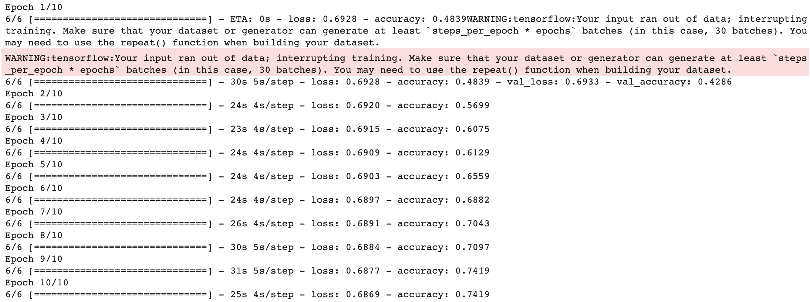

By Group "Nebula"

## Blog 6: Machine Learning Model Training

### Introduction
After extracting non-neutral sentences using FinBERT, we prepare the dataset for model training. These dataset are used to train different models. At last, we compare the performance of the models trained by different dataset.

### Data for Model Training
- Dataset 1: One-hot Encoding (10000 features)
  * The text is prepared using the approach described in Section 3.2.1. This dataset consists of binary vectors that represent the occurrence of tokens in the text as described in Section 4.2. The mapping dictionary only consists of 10000 unique tokens that appear the most in the text.
- Dataset 2: One-hot Encoding (10000 features) (BERT Cleaned)
  * The text is prepared using the approach described in Section 3.2.2. This dataset consists of binary vectors that represent the occurrence of tokens in the text as described in Section 4.2. The mapping dictionary only consists of 10000 unique tokens that appear the most in the text.
- Dataset 3: Bag-of-words (10000 features)
  * The text is prepared using the approach described in Section 3.2.1. This dataset consists of bag-of-words that represent the frequency of tokens in the text as described in Section 4.3. The mapping dictionary only consists of 10000 unique tokens that appear the most in the text.
- Dataset 4: Bag-of-words (10000 features) (BERT Cleaned)
  * The text is prepared using the approach described in Section 3.2.2. This dataset consists of bag-of-words that represent the frequency of tokens in the text as described in Section 4.3. The mapping dictionary only consists of 10000 unique tokens that appear the most in the text.
- Dataset 5: Sentiment Scores (Positive, Neutral, Negative)
  * The text is prepared using the approach described in Section 3.2.1. This dataset consists of sentiment scores (i.e. positive, neutral and negative score) that represent the text as described in Section 4.4.
- Dataset 6: Sentiment Scores (Positive, Neutral, Negative) (BERT Cleaned)
  * The text is prepared using the approach described in Section 3.2.2. This dataset consists of sentiment scores (i.e. positive, neutral and negative score) that represent the text as described in Section 4.4.
- Dataset 7: Sentiment Scores (Compound)
  * The text is prepared using the approach described in Section 3.2.1. This dataset consists of sentiment scores (i.e. compound score) that represent the text as described in Section 4.4.
- Dataset 8: Sentiment Scores (Compound) (BERT Cleaned)
  * The text is prepared using the approach described in Section 3.2.2. This dataset consists of sentiment scores (i.e. compound score) that represent the text as described in Section 4.4.
- Dataset 9: Tokenized (10000 features) (All words)
  * The text is prepared using the approach described in Section 3.2.1. This dataset consists of tokens that represent the text as described in Section 4.1. The mapping dictionary only consists of 10000 unique tokens that appear the most in the text.
- Dataset 10: Tokenized (10000 features) (BERT Cleaned) (All words)
  * The text is prepared using the approach described in Section 3.2.2. This dataset consists of tokens that represent the text as described in Section 4.1. The mapping dictionary only consists of 10000 unique tokens that appear the most in the text.
- Dataset 11: Tokenized (10000 features) (10000 words)
  * The text is prepared using the approach described in Section 3.2.1. This dataset consists of tokens that represent the text as described in Section 4.1. The mapping dictionary only consists of 10000 unique tokens that appear the most in the text. The length of the text is shortened to 10000 words.
- Dataset 12: Tokenized (10000 features) (5949 words)
  * The text is prepared using the approach described in Section 3.2.1. This dataset consists of tokens that represent the text as described in Section 4.1. The mapping dictionary only consists of 10000 unique tokens that appear the most in the text. The length of the text is shortened to 5949 words.

### Machine Learning model
- Logistic Regression (LR)
- Multi-layer Perceptron (MLP)
- Recurrent Neural Network (RNN)

### Experiment Results

#### Logistic Regression
| Logistic Regression (Dataset 1) | Logistic Regression (Dataset 2) | Logistic Regression (Dataset 3) | Logistic Regression (Dataset 4) |
|---------------------------------|---------------------------------|---------------------------------|---------------------------------|
|  |  |  |  |

| Logistic Regression (Dataset 5) | Logistic Regression (Dataset 6) | Logistic Regression (Dataset 7) | Logistic Regression (Dataset 8) | 
|---------------------------------|---------------------------------|---------------------------------|---------------------------------|
|  |  |  |  |

#### Multi-layer Perceptron
| Multi-layer Perceptron (Dataset 1) | Multi-layer Perceptron (Dataset 2) | Multi-layer Perceptron (Dataset 3) | Multi-layer Perceptron (Dataset 4) |
|---------------------------------|---------------------------------|---------------------------------|---------------------------------|
|  |  |  |  |

| Multi-layer Perceptron (Dataset 5) | Multi-layer Perceptron (Dataset 6) | Multi-layer Perceptron (Dataset 7) | Multi-layer Perceptron (Dataset 8) | 
|---------------------------------|---------------------------------|---------------------------------|---------------------------------|
|  |  |  |  |

#### Recurrent Neural Network
| | Recurrent Neural Network (Dataset 9) |
|-|--------------------------------------|
| Train |  |
| Test |  |

| | Recurrent Neural Network (Dataset 10) |
|-|--------------------------------------|
| Train |  |
| Test |  |

| | Recurrent Neural Network (Dataset 11) |
|-|--------------------------------------|
| Train |  |
| Test |  |

| | Recurrent Neural Network (Dataset 12) |
|-|--------------------------------------|
| Train |  |
| Test |  |

### Summary

### Experiment Findings
- Sentiment scores from NLTK Vader Package do not work well
  * Too long text
  * Inconsistent context: NLTK Vader is for movie analysis, but we are using it to do financial sentiment analysis
- Insufficient data cleaning
- Limited training data
- FinBERT data cleaning help boost performance
- Bag-of-words is better than binary vectorization (one-hot encoding)
- Recurrent Neural Network is better

### Future work
- Explore more on Recurrent Neural Network
- Explore more on data cleaning
- Prepare more data
- Use financial-context sentiment analysis package

### Difficulties encountered
The biggest challenge in this step is sentiment analysis runtime. As the text data is very long, sentiment analysis using NLTL Package takes some time.

Another challenge is RNN training. RNN is more complicated compare to other machine learning model. Despite Tensorflow 2 provide a very high level application for RNN, it is still more complicated that sklearn. Hence, some time is needed to explore Tensorflow 2. Moreover, the training time for RNN is very long. When we train an RNN for Dataset 9, it takes around an hour. Hence, it is hard to experiment on neural networks on normal computer without using GPU farms.
